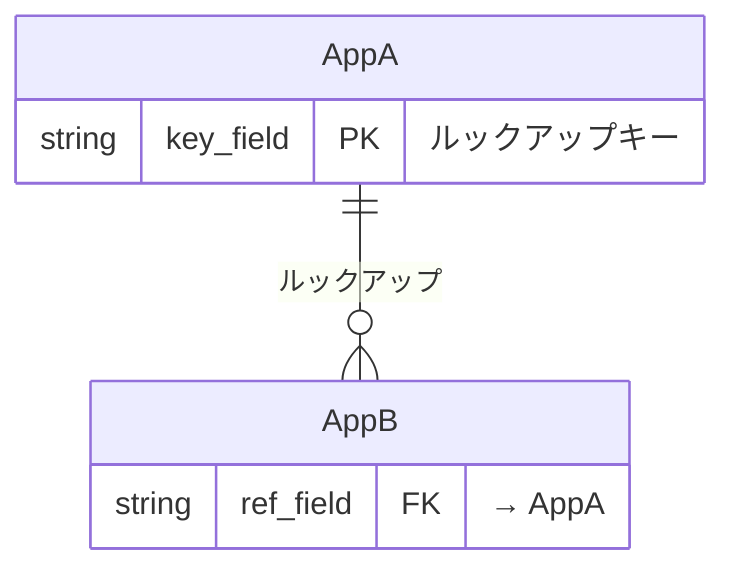

# Phase 3: アプリアーキテクチャ設計（HOW）

ビジネスイベントからアプリ境界を決定し、ER図とキーフィールドを設計します。

## 概要

このスキルは `/kintone-workflow` から呼び出され、以下を実行します：
1. コンテキスト整理 + 業務フロー設計を読み込む
2. ビジネスイベント → アプリ境界を決定
3. アプリ一覧（マスタ/トランザクション分類）を作成
4. ER図をMermaid erDiagramで生成
5. キーフィールド設計（PK、ルックアップキー、ステータスのみ）
6. ユースケース × アプリ マッピング
7. カスタマイズ要件を具体的なアプリ・フィールドにマッピング

出力: `アプリアーキテクチャ_${Project}_${Date}.md`

## 入力

以下を最初に全て読み込むこと:
- `${OutputDir}コンテキスト整理_${Project}_${Date}.md`
- `${OutputDir}業務フロー設計_${Project}_${Date}.md`

## 設計手順

### Step 1: ビジネスイベント → アプリ境界

業務フロー設計のビジネスイベント一覧から、アプリ境界を決定する。

**アプリ分割の判断基準**:
| 基準 | ガイダンス |
|------|----------|
| データ種別 | マスタ（参照データ）とトランザクション（業務データ）を分離 |
| 更新頻度 | 更新頻度が異なるデータは別アプリ |
| アクセス権限 | 権限が異なるデータは別アプリ |
| 業務プロセス | 独立した業務プロセスは別アプリ |

**マッピングテーブルの提示**:
```
ビジネスイベントからアプリの構成を考えました！

| イベント | 生成データ | → アプリ | 種別 |
|---------|-----------|---------|------|
| ... | ... | ... | マスタ/トランザクション |

この構成でよさそうですか？
```

### Step 2: アプリ一覧作成

マスタとトランザクションに分類してアプリ一覧を作成。

### Step 3: ER図生成

Mermaid erDiagram で生成。`kintone-relationship-visualizer` と同じ記法を使用。



**ER図の提示**:
```
アプリ間の関係をER図で表現しました！

[Mermaid図]

矢印の意味:
- ||--o{ : ルックアップ（1対多）
- ||--|| : 関連レコード（1対1）

この関係で合っていますか？
```

### Step 4: キーフィールド設計

以下のフィールドのみ設計（詳細フィールドはPhase 4）:
- **PK**: ルックアップキーとなるフィールド（unique: true 必須）
- **FK**: ルックアップ参照フィールド
- **ステータス**: プロセス管理のステータスフィールド

#### プロセス管理とステータスフィールドの注意

- プロセス管理を使用するアプリでは、ステータスはシステムフィールド（STATUS）として自動管理される
- キーフィールド設計では種別を「プロセス管理（システムフィールド）」と記載し、フィールドコードは「-」とする
- カスタムのドロップダウンフィールドとして設計してはいけない（二重定義になる）
- ステータス値の一覧は備考欄に記載する（Phase 4のプロセス管理設定で使用）

#### PKフィールドの自動採番推奨

ルックアップキーとして使用するPKフィールドは自動採番（`auto_numbering`）を推奨する:
- 手入力によるタイプミス防止
- フォーマットの統一保証
- 推奨フォーマット: `{アプリ略称}-{YYYYMM}-{連番4桁}`（例: `CUST-202602-0001`）
- 例外: 外部システムのIDを使用する場合

### Step 5: ユースケース × アプリ マッピング

全ユースケースがいずれかのアプリでカバーされていることを確認。

### Step 6: カスタマイズ要件マッピング

Phase 2のカスタマイズ要件を読み込み、具体的なアプリ・フィールドに紐付ける。

**マッピング例**:
| カスタマイズ | パターンID | → 対象アプリ | → 対象フィールド | → トリガー条件 |
|------------|-----------|------------|----------------|--------------|
| 完了時の編集ロック | field_disable | 受注管理 | status | status = "完了" |

**注意**: スペーサーIDに言及する場合は `space_{セクション名}` の命名規則に従うこと（例: `space_basic_info`）。`spacer_` プレフィックスは使用しない。

### Step 7: アーキテクチャ文書生成

テンプレート `templates/architecture-template.md` に従い生成:

- `${OutputDir}アプリアーキテクチャ_${Project}_${Date}.md`

## セルフチェックリスト

- [ ] 全ビジネスイベントがいずれかのアプリにマッピングされている
- [ ] マスタ/トランザクションの分類が適切
- [ ] ER図が正しいMermaid erDiagram記法で記述されている
- [ ] ルックアップキーフィールドに unique: true が設定されている
- [ ] 全ユースケースがアプリでカバーされている
- [ ] カスタマイズ要件が具体的なアプリ・フィールドにマッピングされている
- [ ] 循環参照がない

## 注意事項

1. **キーフィールドのみ**: 詳細フィールド設計はPhase 4で行う
2. **ER図記法の統一**: `kintone-relationship-visualizer` と同じ記法でデプロイ後に検証可能
3. **1アプリ30フィールド以内**: フィールド数が多くなりそうな場合はアプリ分割を検討
4. **循環参照禁止**: ルックアップの循環参照はkintoneでは不可
