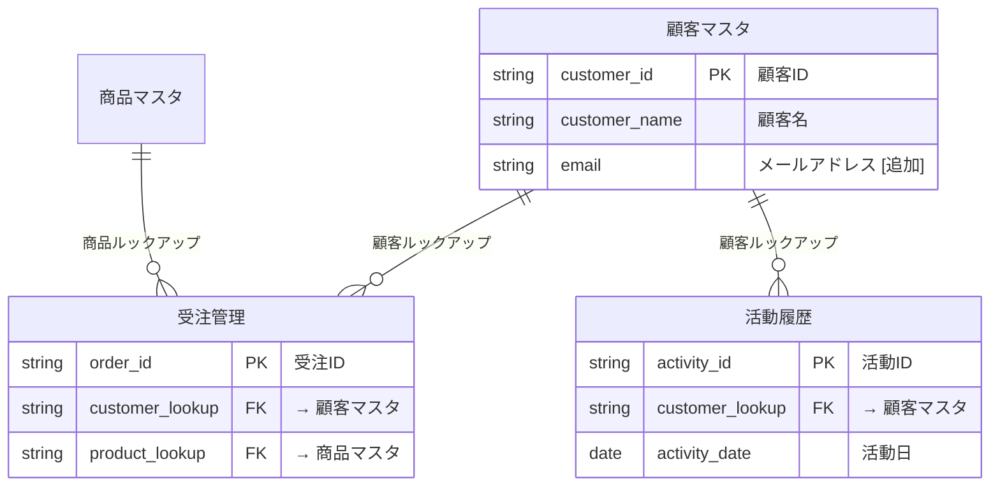

# Phase R2: 変更計画作成

ユーザーの自然言語要望を構造化された変更計画に変換する手順書。

## 概要

| 項目 | 内容 |
|------|------|
| インプット | `現状分析_${Project}_${Date}.md` + ユーザーの変更要望 |
| アウトプット | `変更計画_${Project}_${Date}.md` |
| テンプレート | `templates/change-plan-template.md` |
| 実行エージェント | `kintone-change-planner` |

## Step R2-1: 要望ヒアリング

### ヒアリング方針

ユーザーの変更要望を以下の観点で具体化する:

1. **何を変更したいか**: フィールド追加？アプリ追加？関係変更？
2. **なぜ変更したいか**: 業務上の理由（リスク判断に使用）
3. **どのアプリに**: 対象アプリの特定
4. **優先度**: 複数要望がある場合の優先順位

### AskUserQuestionの使い方

- 最初の質問: 「現状分析を確認しました。どのような変更をしたいですか？」
- 曖昧な回答: 具体的なアプリ名・フィールド名を確認
- 新規アプリの場合: 格納するデータ、関連アプリ、フィールド構成を確認

## Step R2-2: 変更操作の分解

### 対応する変更種別

| 種別 | 操作 | API | リスク |
|------|------|-----|--------|
| ADD field | フィールド追加 | POST /preview/app/form/fields.json | 低 |
| MODIFY field | フィールドプロパティ変更 | PUT /preview/app/form/fields.json | 低〜中 |
| DELETE field | フィールド削除 | DELETE /preview/app/form/fields.json | **高** |
| ADD app | 新規アプリ追加 | POST /preview/app.json | 低 |
| ADD lookup | ルックアップ追加 | POST /preview/app/form/fields.json | 中 |
| MODIFY lookup | ルックアップ変更 | PUT /preview/app/form/fields.json | 中〜高 |
| DELETE lookup | ルックアップ削除 | DELETE /preview/app/form/fields.json | **高** |
| ADD/MODIFY view | ビュー操作 | PUT /preview/app/views.json | 低 |
| ADD/MODIFY process | プロセス管理変更 | PUT /preview/app/status.json | 中 |
| ADD/MODIFY customize | カスタマイズ変更 | PUT /preview/app/customize.json | 低 |

### kintone制約チェック

変更要望を分解する際、以下のkintone制約を確認:

| 制約 | 対処 |
|------|------|
| フィールドタイプの変更は不可 | 新フィールド作成 + 旧フィールド削除を提案 |
| サブテーブル内フィールドの個別更新は不可 | サブテーブル全体を再定義 |
| ルックアップキーに `unique: true` が必要 | 新規ルックアップ追加時に確認 |
| 参照先アプリはデプロイ済みが必要 | 新規アプリのデプロイ順序を考慮 |
| フィールドコードの変更は不可 | 新フィールド作成 + 旧フィールド削除 |

## Step R2-3: リスク評価

### リスクレベル基準

| レベル | 基準 | 対応 |
|--------|------|------|
| **高** | データ損失の可能性あり（DELETE操作、フィールドタイプ変更） | ユーザーに明示的確認必須 |
| **中** | 既存データへの影響あり（MODIFY操作、関係変更） | ユーザーに影響を説明 |
| **低** | 新規追加のみ（ADD操作） | 確認不要 |

### DELETE操作の取り扱い

DELETE操作を含む場合、必ず以下を確認:
1. 対象フィールドのデータが失われることを明示
2. AskUserQuestionで明示的な承認を取得
3. 承認された場合のみ変更計画に含める

## Step R2-4: 適用順序計画（3-Pass）

### Pass U1: 基本フィールド変更
- ルックアップ/関連レコード以外のフィールド変更
- DELETE → MODIFY → ADD の順（依存関係を最小化）
- 変更完了後にデプロイ

### Pass U2: 新規アプリ + 関係変更
- 新規アプリがある場合:
  1. アプリ作成 + 基本フィールド追加
  2. デプロイ
- ルックアップ/関連レコードの追加・変更:
  1. マスタアプリ優先
  2. 参照先 → 参照元の順
- 中間デプロイ（各ルックアップ追加後）

### Pass U3: レイアウト・ビュー・プロセス管理・カスタマイズ
- レイアウト更新
- ビュー更新
- プロセス管理更新
- カスタマイズ更新（既存保持 + 新規追加）
- 最終デプロイ

## Step R2-5: 変更計画書生成

`templates/change-plan-template.md` に従い以下を含む:

1. **変更概要**: 理由、影響範囲、操作数
2. **変更詳細**: 全操作のADD/MODIFY/DELETE一覧
3. **関係変更**: ルックアップ/関連レコードの変更
4. **保持する設定**: 変更しない設定の明示
5. **リスク評価**: リスク一覧
6. **適用順序**: 3-Pass計画
7. **更新後ER図**: 変更反映済みMermaid図（下記ルール参照）

### 更新後ER図の生成ルール

**重要**: 更新後ER図は `open_drawio_mermaid` MCPツールで draw.io に表示される。Checkpoint R2でユーザーが図を見て変更内容を確認・修正できるようにする。

#### 生成手順

1. 現状分析書のER図（Mermaid）をベースにコピー
2. 変更計画の内容を反映:
   - **新規アプリ追加**: テーブル定義を追加、関係線を追加
   - **フィールド追加**: 該当テーブルにフィールド行を追加（PK/FKの場合）
   - **フィールド削除**: 該当テーブルからフィールド行を削除
   - **ルックアップ追加**: 関係線（`||--o{`）を追加
   - **ルックアップ削除**: 関係線を削除
3. 変更箇所をコメントでマーク

#### 記法例

#### 変更マーカー

- `[追加]`: 新規追加されたアプリ・フィールド・関係
- `[変更]`: 変更されたフィールド
- `[削除予定]`: 削除予定のフィールド（計画確認のため残す）
- Mermaidコメント（`%%`）で変更箇所をマーク

## 注意事項

1. **ユーザーの要望に忠実**: 勝手に追加の変更を提案しない
2. **リスクは正直に**: 高リスク操作は必ず明示
3. **kintone制約を遵守**: 不可能な変更は代替案を提示
4. **保持する設定を明記**: 意図せぬ上書きを防止
