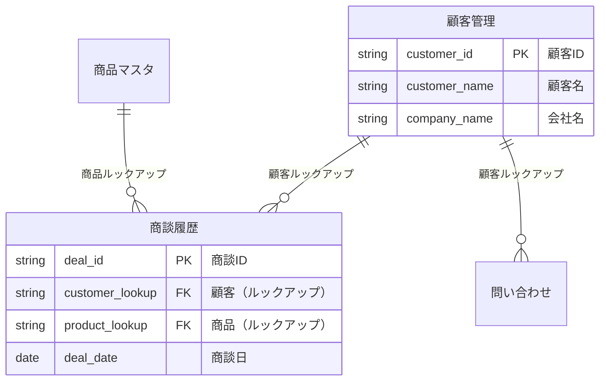
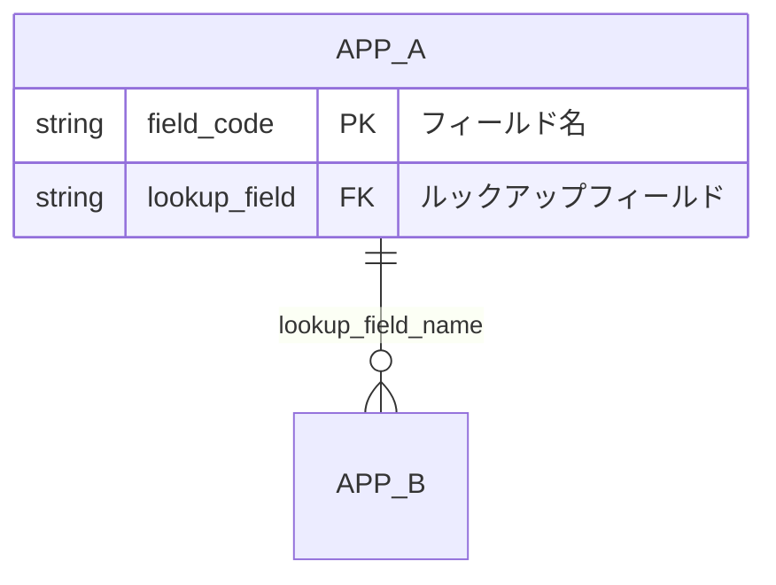

# kintone Relationship Visualizer

kintoneアプリ間の関係をMermaid ER図で可視化するスキルです。

## 概要

このスキルは以下を提供します：
- アプリ間のルックアップ関係の抽出
- 関連レコード一覧の関係の抽出
- Mermaid ER図形式での出力
- デプロイ順序の提案

## 使い方

### 基本的な使い方

```
/kintone-relationship-visualizer [アプリID1] [アプリID2] ...
```

アプリIDを指定しない場合は、全アプリを対象にします。

### 出力例



## 実行手順

### ステップ1: 対象アプリの取得

```
kintone-get-apps で対象アプリを取得
```

### ステップ2: 各アプリのフィールド取得

```
kintone-get-form-fields(app: "APP_ID") で各アプリのフィールドを取得
```

### ステップ3: 関係の抽出

以下のフィールドタイプから関係を抽出：

| フィールドタイプ | 関係の種類 | Mermaid記法 |
|----------------|-----------|-------------|
| LOOKUP | 多対1 | `Parent \|\|--o{ Child` |
| REFERENCE_TABLE | 1対多（表示のみ） | `Parent \|\|--o{ Child` (点線) |

### ステップ4: Mermaid ER図の生成



## 関係の読み方

| 記号 | 意味 |
|------|------|
| `\|\|` | 1（必須） |
| `o\|` | 0または1 |
| `}o` | 0以上（多） |
| `}\|` | 1以上（多） |

### よくある関係パターン

```
マスタ ||--o{ トランザクション : "ルックアップ"
```
→ 1つのマスタレコードに対して、複数のトランザクションが紐づく

## デプロイ順序の提案

ER図から依存関係を分析し、正しいデプロイ順序を提案：

```
## 推奨デプロイ順序

1. 顧客管理（参照されるマスタ）
2. 商品マスタ（参照されるマスタ）
   ↓ デプロイ
3. 商談履歴（ルックアップあり）
   ↓ デプロイ
4. 顧客管理に関連レコード一覧を追加
   ↓ 再デプロイ
```

**ルール**:
- 参照される側（マスタ）を先にデプロイ
- ルックアップを含むアプリは参照先デプロイ後に作成
- 関連レコード一覧は最後に追加

## 出力ファイル

`outputs/` ディレクトリに以下を生成：

### ER図_{Project}_{Date}.md

```markdown
# kintone アプリ関係図

## ER図

\`\`\`mermaid
erDiagram
    ...
\`\`\`

## アプリ一覧

| アプリID | アプリ名 | 種別 | 参照先 | 参照元 |
|----------|----------|------|--------|--------|

## 推奨デプロイ順序

1. ...
2. ...

## 注意事項

- ルックアップ先は必ず先にデプロイすること
- 関連レコード一覧は双方がデプロイ済みの状態で追加すること
```

## トラブルシューティング

### 循環参照の検出

```
⚠️ 循環参照を検出しました:
  アプリA → アプリB → アプリA

解決策:
- 関連レコード一覧を使用して片方向のみルックアップに変更
- または中間テーブルを検討
```

### 孤立アプリの検出

```
ℹ️ 他のアプリと関係のないアプリ:
  - 設定マスタ（ID: 123）

これらは任意のタイミングでデプロイ可能です。
```

## 次のステップ

ER図生成後：
1. デプロイ順序を確認
2. `kintone-deployer` エージェントでデプロイ実行
3. 必要に応じてレイアウト調整

## 関連エージェント・スキル

- `kintone-designer`: アプリ・フィールド設計
- `kintone-deployer`: デプロイ実行
- `kintone-layouter`: レイアウト調整
