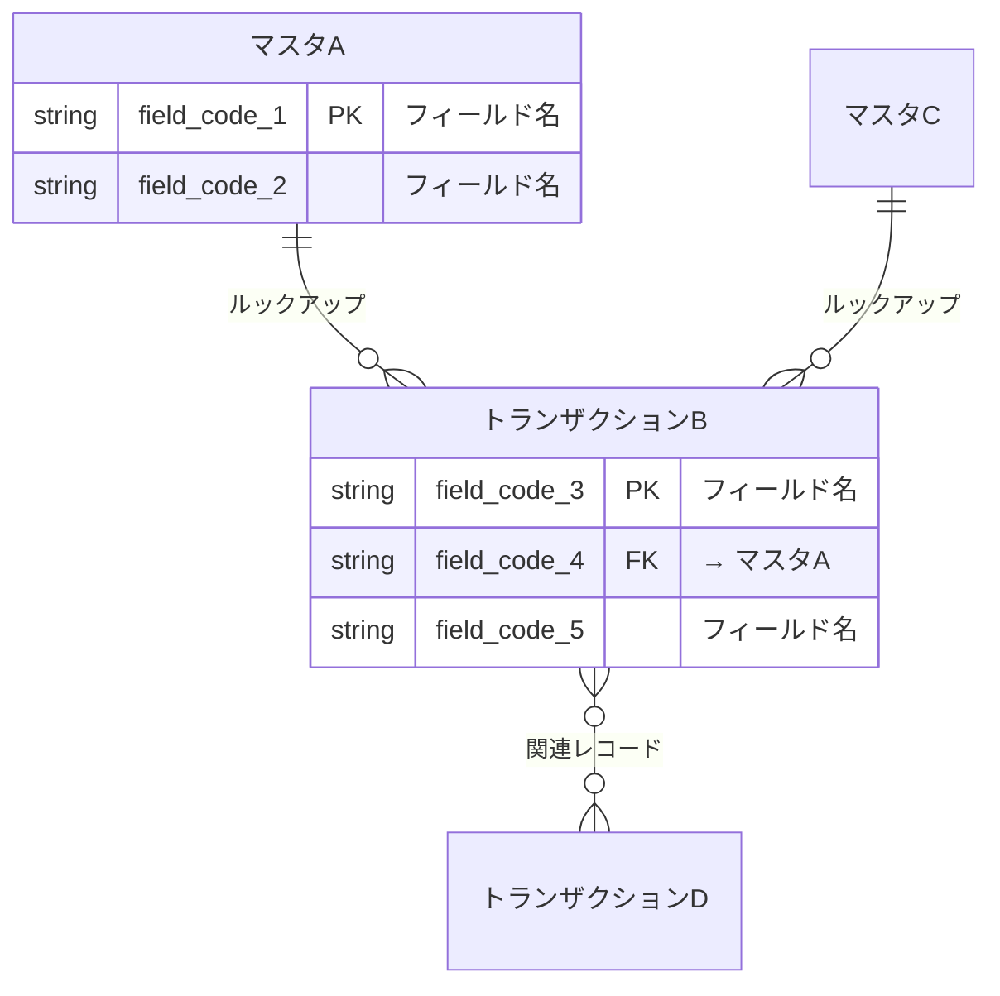

# Phase R1: リバースエンジニアリング

既存kintoneアプリの設定をREST APIで読み込み、現状分析書を生成する手順書。

## 概要

| 項目 | 内容 |
|------|------|
| インプット | ターゲットアプリID一覧（`${TargetAppIds}`） |
| アウトプット | `現状分析_${Project}_${Date}.md` |
| テンプレート | `templates/current-state-template.md` |
| 実行エージェント | `kintone-reverse-engineer` |

## Step R1-1: 選択アプリの情報取得

各ターゲットアプリに対して以下のAPIを実行:

### API呼び出し一覧

| No | API | メソッド | 取得情報 |
|----|-----|---------|---------|
| 1 | `/k/v1/app.json?id=${APP_ID}` | GET | アプリ基本情報（名前、説明、作成者） |
| 2 | `/k/v1/app/form/fields.json?app=${APP_ID}` | GET | 全フィールド定義 |
| 3 | `/k/v1/app/form/layout.json?app=${APP_ID}` | GET | フォームレイアウト |
| 4 | `/k/v1/app/views.json?app=${APP_ID}` | GET | ビュー定義 |
| 5 | `/k/v1/app/customize.json?app=${APP_ID}` | GET | カスタマイズJS/CSS |
| 6 | `/k/v1/app/status.json?app=${APP_ID}` | GET | プロセス管理 |

### 進捗表示

```
[R1-1] アプリ情報取得
  (1/${AppCount}): ${アプリ名1} ... OK
  (2/${AppCount}): ${アプリ名2} ... OK
  ...
```

## Step R1-2: 依存アプリの自動検出

### 検出ロジック

1. 全ターゲットアプリのフィールド定義を走査
2. `lookup` プロパティを持つフィールドから `relatedApp.app` を抽出
3. `type: REFERENCE_TABLE` フィールドから `referenceTable.relatedApp.app` を抽出
4. 参照先アプリIDがターゲット一覧（`${TargetAppIds}`）に含まれない場合:
   - 「未選択の依存アプリ」として記録
   - エージェントの出力に依存アプリ情報を含める
   - **メインオーケストレーターがAskUserQuestionで追加確認**

### 依存アプリの追加フロー（メインオーケストレーター側）

```
エージェント結果に依存アプリ情報が含まれる場合:
1. AskUserQuestion: "${アプリA} が参照している ${アプリC}（ID: ${ID}）も対象に追加しますか？"
2. 追加承認 → エージェントを再起動して追加アプリも取得
3. 追加拒否 → 現状分析書の関係詳細に「対象外」として記載
```

## Step R1-3: フィールド分類と関係グラフ構築

### フィールド分類

| 条件 | 分類 |
|------|------|
| `unique: true` | PK候補 |
| `lookup` プロパティあり | FK（ルックアップ） |
| `type: REFERENCE_TABLE` | 関連レコード一覧 |
| `type: SUBTABLE` | サブテーブル（子フィールドも走査） |
| RECORD_NUMBER, CREATOR, CREATED_TIME, MODIFIER, UPDATED_TIME, STATUS, STATUS_ASSIGNEE, CATEGORY | システムフィールド（スキップ） |

### アプリ種別判定

| 判定条件 | 種別 |
|---------|------|
| 他のアプリからルックアップで参照されている | マスタ |
| マスタをルックアップで参照している | トランザクション |
| 他アプリとの関係がない | 独立 |

### 関係グラフ構築

全アプリのlookup/referenceTableフィールドからアプリ間の依存関係を抽出し:
- Mermaid erDiagram形式のER図を生成
- 依存グラフ（テキスト形式）を生成

### Mermaid ER図の生成ルール

**重要**: ER図は `open_drawio_mermaid` MCPツールで draw.io に表示されるため、draw.ioが正しくパースできる形式で生成すること。

#### 記法



#### 関係記号

| 関係タイプ | 記号 | 用途 |
|-----------|------|------|
| ルックアップ（1:N） | `\|\|--o{` | マスタ → トランザクション |
| 関連レコード一覧（表示のみ） | `}o--o{` | 参照方向の表示 |
| 1:1 | `\|\|--\|\|` | 1対1ルックアップ |

#### フィールド記載ルール

- **PK候補**（`unique: true`）: `string field_code PK "フィールド名"`
- **FK**（ルックアップ）: `string field_code FK "→ 参照先アプリ名"`
- **主要フィールドのみ**: ER図にはPK/FK/ステータスフィールドのみ記載（全フィールドは一覧テーブルに記載）
- **システムフィールドは除外**: RECORD_NUMBER, CREATOR 等は記載しない

#### テーブル名

- **日本語アプリ名をそのまま使用**: draw.ioで可読性を確保
- スペースはアンダースコアに置換（Mermaid制約がある場合）

## 出力: 現状分析書

`templates/current-state-template.md` に従い以下を含む:

1. **アプリ一覧テーブル**: 全ターゲットアプリ + 追加された依存アプリ
2. **ER図**: Mermaid erDiagram形式
3. **各アプリ詳細**: 基本情報、フィールド一覧、ルックアップ、ビュー、プロセス管理、カスタマイズ
4. **関係詳細**: ルックアップ一覧、関連レコード一覧、依存グラフ
5. **サマリ**: 統計情報

## 注意事項

1. **APIレスポンスに忠実**: 推測でフィールドを追加・変更しない
2. **カスタマイズの中身は解析しない**: ファイル数と適用範囲のみ記録
3. **アプリ設計書・フィールド設計書はこのフェーズでは生成しない**: Phase R3の`kintone-design-updater`が生成する
4. **システムフィールドはスキップ**: ER図やフィールド一覧から除外
