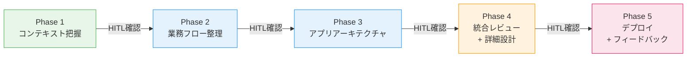
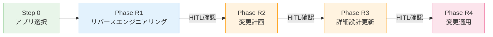

# kintone-live-coding

対話形式でkintoneアプリを作成・修正するワークフロー。Claude Codeスキルとして動作します。

## クイックスタート

```
/start     # 新規アプリ作成
/restart   # 既存アプリ修正
```

## 前提条件

### 環境変数の設定

`.env` ファイルをプロジェクトルートに作成：

```env
KINTONE_DOMAIN=https://xxx.cybozu.com
KINTONE_USERNAME=your-username
KINTONE_PASSWORD=your-password
```

**重要**: `.env` は `.gitignore` に追加済みなので、絶対にコミットしないこと。

## 概要

業務担当者（非エンジニア）がkintoneアプリを作成・修正する際、対話形式で情報を収集し、コンテキスト整理→業務フロー設計→アプリアーキテクチャ→統合レビュー→デプロイまでを一貫して支援します。

## ワークフロー

### `/start`（新規作成）：5フェーズ構成



| Phase | 内容 | 出力 |
|-------|------|------|
| **Phase 1** コンテキスト把握 | ペインポイント起点でWHO/WHYを整理 | コンテキスト整理書 |
| **Phase 2** 業務フロー整理 | As-Is/To-Beフロー設計、ビジネスイベント洗い出し、カスタマイズ提案 | 業務フロー設計書 |
| **Phase 3** アプリアーキテクチャ | ビジネスイベントからアプリ境界を決定、ER図生成 | アプリアーキテクチャ設計書 |
| **Phase 4** 統合レビュー + 詳細設計 | Phase 1-3のクロスバリデーション、アプリ・フィールド設計書生成 | 統合レビュー、アプリ設計書、フィールド設計書 |
| **Phase 5** デプロイ + フィードバック | 2-Passデプロイ、カスタマイズ適用、テストデータ投入 | デプロイ済みアプリ |

### `/restart`（既存修正）：5ステップ構成



| Phase | 内容 | 出力 |
|-------|------|------|
| **Step 0** アプリ選択 | スペースID指定 → アプリ一覧表示 → 対象アプリ選択 | - |
| **Phase R1** リバースエンジニアリング | 既存アプリのREST API読み込み → 現状分析 | 現状分析書 |
| **Phase R2** 変更計画 | ユーザーの変更要望 → 構造化された変更計画 | 変更計画書 |
| **Phase R3** 詳細設計更新 | 現状分析 + 変更計画 → 設計書の生成・更新 | アプリ設計書、フィールド設計書 |
| **Phase R4** 変更適用 | 5-Passアップデートデプロイでkintoneに変更を適用 | 更新済みアプリ |

## HITL（Human-in-the-Loop）

各Phase移行前に必ず確認プロセスを通します。スキップ不可です。

## デプロイ方式

### 新規作成（2-Passデプロイ）

| Pass | 内容 |
|------|------|
| **Pass 1** | 全アプリ作成 + 基本フィールド追加 → デプロイ |
| **Pass 2** | ルックアップ/関連レコード追加 + レイアウト最適化 → 再デプロイ |

### 既存修正（5-Passアップデートデプロイ）

| Pass | 内容 |
|------|------|
| **Pass U1** | 基本フィールド変更（DELETE → MODIFY → ADD） |
| **Pass U2** | 新規アプリ + 関係変更（依存順） |
| **Pass U3** | プロセス管理更新 |
| **Pass U4** | レイアウト最適化 |
| **Pass U5** | ビュー更新 |

## 利用可能なスキル

### メインスキル

| スキル | コマンド | 説明 |
|--------|----------|------|
| kintone-workflow | `/kintone-workflow` | 新規作成ワークフロー（Phase 1〜5） |
| kintone-restart-workflow | `/kintone-restart-workflow` | 既存修正ワークフロー（Phase R1〜R4） |

### フェーズ別スキル（`/start`）

| スキル | コマンド | Phase |
|--------|----------|-------|
| kintone-context-gathering | `/kintone-context-gathering` | Phase 1: コンテキスト把握 |
| kintone-flow-design | `/kintone-flow-design` | Phase 2: 業務フロー設計 |
| kintone-architecture | `/kintone-architecture` | Phase 3: アプリアーキテクチャ |
| kintone-integration-review | `/kintone-integration-review` | Phase 4: 統合レビュー |
| kintone-app-design | `/kintone-app-design` | Phase 4: アプリ設計書生成 |
| kintone-field-design | `/kintone-field-design` | Phase 4: フィールド設計書生成 |
| kintone-app-creation | `/kintone-app-creation` | Phase 5: 2-Passデプロイ |
| kintone-customize | `/kintone-customize` | Phase 5: カスタマイズ適用 |

### フェーズ別スキル（`/restart`）

| スキル | コマンド | Phase |
|--------|----------|-------|
| kintone-reverse-engineering | `/kintone-reverse-engineering` | Phase R1: リバースエンジニアリング |
| kintone-change-planning | `/kintone-change-planning` | Phase R2: 変更計画作成 |
| kintone-app-update | `/kintone-app-update` | Phase R4: 5-Passアップデートデプロイ |

### ユーティリティスキル

| スキル | コマンド | 説明 |
|--------|----------|------|
| kintone-mcp-setup | `/kintone-mcp-setup` | kintone接続のセットアップ支援 |
| kintone-testdata | `/kintone-testdata` | デプロイ済みアプリにテストデータを自動投入（3件） |
| kintone-error-handbook | `/kintone-error-handbook` | REST APIエラーコード別対処法ハンドブック |
| kintone-relationship-visualizer | `/kintone-relationship-visualizer` | アプリ間の関係をMermaid ER図で可視化 |
| drawio-diff | `/drawio-diff` | draw.io ER図と設計書の差分検出・自動更新 |

### レビュースキル（HITL前自動実行）

| スキル | 説明 |
|--------|------|
| kintone-design-review | 設計書のkintone制限値・設計パターンを検証 |
| kintone-creation-review | デプロイ前のAPI制限値・デプロイ順序を検証 |

## 利用可能なサブエージェント

| エージェント | 用途 |
|--------------|------|
| kintone-setup | kintone接続のセットアップ確認・支援 |
| kintone-context-analyst | ペインポイント起点のヒアリング・コンテキスト整理書生成 |
| kintone-flow-analyst | 業務フロー分析・ビジネスイベント洗い出し |
| kintone-architect | ビジネスイベントからアプリ境界決定・ER図生成 |
| kintone-designer | アプリ設計書・フィールド設計書の生成 |
| kintone-design-updater | 変更計画に基づく設計書の更新 |
| kintone-deployer | kintoneへの新規デプロイ実行（REST API） |
| kintone-updater | 既存kintoneアプリへの変更適用（5-Pass） |
| kintone-customizer | カスタマイズコードの生成・REST APIで適用 |
| kintone-reverse-engineer | 既存アプリの読み込み・現状分析書生成 |
| kintone-change-planner | ユーザーの変更要望を構造化された変更計画に変換 |

## カスタマイズパターン（18パターン / 9カテゴリ）

パターンベースでkintoneカスタマイズコード（JavaScript/CSS）を自動生成します。

| カテゴリ | パターン |
|----------|----------|
| フィールド制御 | `field_show_hide`, `field_disable`, `field_char_count`, `dropdown_cascade`, `group_toggle` |
| 条件分岐 | `condition_status` |
| バリデーション | `validate_required`, `validate_format` |
| 見た目装飾 | `style_section_header` |
| 自動処理 | `auto_numbering`, `lookup_auto_update` |
| 一覧画面 | `list_button`, `list_conditional_style`, `list_progress_bar` |
| テーブル | `table_total`, `table_add_row` |
| プロセス管理 | `auto_status_update` |
| 日付・時刻 | `elapsed_years` |

## ディレクトリ構造

```
kintone-live-coding/
├── .claude/
│   ├── commands/                        # スラッシュコマンド
│   │   ├── start.md                    # /start → 新規作成ワークフロー
│   │   └── restart.md                  # /restart → 既存修正ワークフロー
│   ├── agents/                          # サブエージェント定義
│   │   ├── kintone-setup.md            # 接続セットアップ支援
│   │   ├── kintone-context-analyst.md  # コンテキスト把握・ヒアリング
│   │   ├── kintone-flow-analyst.md     # 業務フロー分析
│   │   ├── kintone-architect.md        # アプリアーキテクチャ設計
│   │   ├── kintone-designer.md         # アプリ・フィールド設計
│   │   ├── kintone-design-updater.md   # 設計書更新（/restart用）
│   │   ├── kintone-deployer.md         # 新規デプロイ実行
│   │   ├── kintone-updater.md          # 既存アプリ更新（/restart用）
│   │   ├── kintone-customizer.md       # カスタマイズ生成・適用
│   │   ├── kintone-reverse-engineer.md # リバースエンジニアリング
│   │   ├── kintone-change-planner.md   # 変更計画作成
│   │   └── reference/                  # エージェント参照資料
│   │       ├── context-interview-flow.md
│   │       └── flow-analysis-guide.md
│   ├── rules/                           # プロジェクトルール
│   │   ├── kintone-api.md              # REST API操作・認証ルール
│   │   ├── priority-deployment.md      # 2-Pass / 5-Passデプロイルール
│   │   └── customize-patterns.md       # カスタマイズパターン定義
│   └── skills/                          # スキル定義
│       ├── kintone-workflow/           # メインワークフロー（/start）
│       ├── kintone-restart-workflow/   # 既存修正ワークフロー（/restart）
│       ├── kintone-context-gathering/  # Phase 1: コンテキスト把握
│       ├── kintone-flow-design/        # Phase 2: 業務フロー設計
│       ├── kintone-architecture/       # Phase 3: アーキテクチャ
│       ├── kintone-integration-review/ # Phase 4: 統合レビュー
│       ├── kintone-app-design/         # Phase 4: アプリ設計書
│       ├── kintone-field-design/       # Phase 4: フィールド設計書
│       ├── kintone-app-creation/       # Phase 5: 2-Passデプロイ
│       │   └── scripts/               # デプロイ用Pythonスクリプト
│       ├── kintone-customize/          # Phase 5: カスタマイズ適用
│       ├── kintone-reverse-engineering/# Phase R1: リバースエンジニアリング
│       ├── kintone-change-planning/    # Phase R2: 変更計画
│       ├── kintone-app-update/         # Phase R4: 5-Passアップデートデプロイ
│       ├── kintone-design-review/      # 設計書レビュー
│       ├── kintone-creation-review/    # デプロイ前レビュー
│       ├── kintone-mcp-setup/          # 接続セットアップ
│       ├── kintone-testdata/           # テストデータ投入
│       ├── kintone-error-handbook/     # エラー対処法
│       ├── kintone-relationship-visualizer/ # ER図可視化
│       └── drawio-diff/               # draw.io差分検出
├── templates/                           # ドキュメントテンプレート
│   ├── context-template.md            # コンテキスト整理書
│   ├── flow-design-template.md        # 業務フロー設計書
│   ├── architecture-template.md       # アプリアーキテクチャ
│   ├── integration-review-template.md # 統合レビュー
│   ├── app-design-template.md         # アプリ設計書
│   ├── field-design-template.md       # フィールド設計書
│   ├── current-state-template.md      # 現状分析書（/restart用）
│   ├── change-plan-template.md        # 変更計画書（/restart用）
│   ├── feedback-template.md           # フィードバック
│   └── customize/                      # カスタマイズテンプレート
│       ├── catalog.json               # パターンカタログ（v2.0.0、18パターン）
│       ├── patterns/                  # JSパターンテンプレート（18ファイル）
│       └── styles/                    # CSSテンプレート
├── scripts/                            # ユーティリティスクリプト
│   └── drawio-pull.js                 # draw.io XML取得
├── outputs/                            # 生成ドキュメント出力先（gitignore対象）
├── CLAUDE.md                           # Claude Code設定
└── README.md
```

## 出力ファイル

### 出力先ディレクトリ

```
outputs/${ProjectName}/
```

### ファイル命名規則

#### `/start`（新規作成）

| ドキュメント種別 | ファイル名例 |
|------------------|-------------|
| コンテキスト整理書 | `コンテキスト整理_顧客管理_20260215.md` |
| 業務フロー設計書 | `業務フロー設計_顧客管理_20260215.md` |
| アプリアーキテクチャ | `アプリアーキテクチャ_顧客管理_20260215.md` |
| 統合レビュー | `統合レビュー_顧客管理_20260215.md` |
| アプリ設計書 | `アプリ設計書_顧客管理_20260215.md` |
| フィールド設計書 | `フィールド設計書_顧客管理_20260215.md` |

#### `/restart`（既存修正）

| ドキュメント種別 | ファイル名例 |
|------------------|-------------|
| 現状分析書 | `現状分析_受注管理_20260215.md` |
| 変更計画書 | `変更計画_受注管理_20260215.md` |
| アプリ設計書 | `アプリ設計書_受注管理_20260215.md` |
| フィールド設計書 | `フィールド設計書_受注管理_20260215.md` |

## 対応機能

- アプリ新規作成（`/start`）
- 既存アプリの修正（`/restart`）
- ルックアップ/関連レコード一覧
- プロセス管理
- カスタマイズコード自動生成・適用（18パターン）
- テストデータ自動投入
- draw.io ER図との差分検出・設計書自動更新

## 制約事項

- **REST APIのみ使用**: Bash + curlで直接呼び出し（MCPツールは使用しない）
- **2-Passデプロイ**（新規）: Pass 1で基本フィールド、Pass 2でルックアップ/関連レコード
- **5-Passアップデートデプロイ**（既存修正）: フィールド→関係→プロセス管理→レイアウト→ビュー
- **HITL必須**: 各Phase移行前の確認はスキップ不可
- `.env`ファイルは絶対にコミットしないこと
