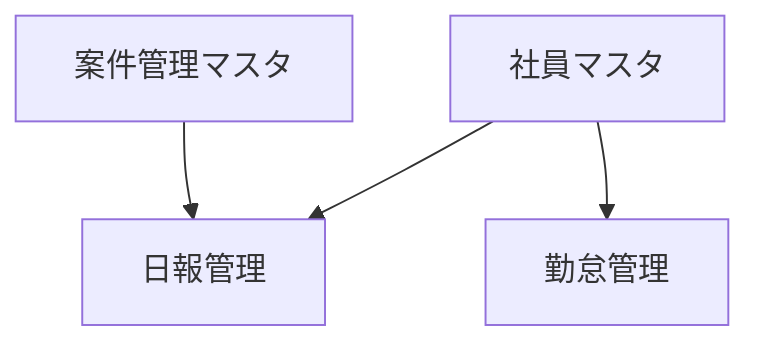

# 日報・勤怠管理 アプリ設計書

作成日: 2026/02/06
関連文書: システム概要書_日報・勤怠管理_20260206.md, 機能要件書_日報・勤怠管理_20260206.md, 業務フロー_日報・勤怠管理_20260206.md

## 1. アプリ一覧

| No | アプリ名 | アプリコード | 種別 | 説明 |
|----|----------|--------------|------|------|
| 1  | 社員マスタ | employee_master | マスタ | 社員の基本情報を管理（社員番号、氏名、部署、役職、上長等） |
| 2  | 案件管理マスタ | project_master | マスタ | 案件情報を管理（案件コード、案件名、顧客名、期間、ステータス） |
| 3  | 日報管理 | daily_report | トランザクション | 日々の業務報告を管理（作業内容、作業時間、承認フロー） |
| 4  | 勤怠管理 | attendance | トランザクション | 出退勤情報を管理（出勤時刻、退勤時刻、勤務時間、承認フロー） |

※種別:
- マスタ: 基本情報を管理するアプリ（社員、案件など）
- トランザクション: 日々の業務データを管理するアプリ（日報、勤怠など）

## 2. アプリ間連携図

```
┌──────────────────┐                    ┌──────────────────┐
│  社員マスタ       │                    │  案件管理マスタ   │
│  (マスタ)         │                    │  (マスタ)         │
└────────┬─────────┘                    └────────┬─────────┘
         │ ルックアップ                           │ ルックアップ
         │                                        │
         ▼                                        │
┌──────────────────┐                              │
│  勤怠管理         │                              │
│  (トランザクション) │                              │
└──────────────────┘                              │
                                                  │
         │ ルックアップ                           │
         ▼                                        ▼
┌──────────────────────────────────────────────────┐
│                    日報管理                       │
│                  (トランザクション)                │
└──────────────────────────────────────────────────┘
```

## 3. アプリ間連携詳細

### 3.1 ルックアップ設定

| No | 参照元アプリ | 参照先アプリ | キーフィールド | コピーフィールド |
|----|--------------|--------------|----------------|------------------|
| 1  | 日報管理 | 社員マスタ | 社員番号 | 社員名、部署、上長 |
| 2  | 日報管理 | 案件管理マスタ | 案件コード | 案件名、顧客名 |
| 3  | 勤怠管理 | 社員マスタ | 社員番号 | 社員名、部署、上長 |

### 3.2 関連レコード一覧設定

| No | 表示元アプリ | 参照先アプリ | 紐付け条件 | 表示フィールド |
|----|--------------|--------------|------------|----------------|
| 1  | 社員マスタ | 日報管理 | 社員番号 = 社員番号 | 日付, 案件名, 作業内容, ステータス |
| 2  | 社員マスタ | 勤怠管理 | 社員番号 = 社員番号 | 日付, 出勤時刻, 退勤時刻, 勤務時間, ステータス |
| 3  | 案件管理マスタ | 日報管理 | 案件コード = 案件コード | 日付, 社員名, 作業内容, 作業時間 |

## 4. アプリ詳細設計

### 4.1 社員マスタ

#### 基本情報

| 項目 | 値 |
|------|-----|
| アプリ名 | 社員マスタ |
| アプリコード | employee_master |
| 種別 | マスタ |
| 説明 | 社員の基本情報を管理するマスタアプリ。日報・勤怠からルックアップで参照される。 |
| 想定レコード数 | 50〜200件 |

#### 用途・目的
社員の基本情報（社員番号、氏名、部署、役職等）を一元管理する。日報管理・勤怠管理アプリからルックアップで参照され、入力の手間を削減し、データの整合性を担保する。上長フィールドにより、承認者の自動判定が可能となる。

#### 主な操作者
- 管理者（人事部・総務部）: 社員情報の登録・更新・削除
- マネージャー: 部下情報の参照

#### プロセス管理

**有効化**: false

（マスタデータのため、プロセス管理は使用しない）

### 4.2 案件管理マスタ

#### 基本情報

| 項目 | 値 |
|------|-----|
| アプリ名 | 案件管理マスタ |
| アプリコード | project_master |
| 種別 | マスタ |
| 説明 | 案件情報を管理するマスタアプリ。日報からルックアップで参照される。 |
| 想定レコード数 | 100〜500件 |

#### 用途・目的
案件の基本情報（案件コード、案件名、顧客名、期間等）を一元管理する。日報管理アプリからルックアップで参照され、案件別の稼働実績を集計可能にする。

#### 主な操作者
- 管理者: 案件情報の登録・更新・削除
- マネージャー: 案件情報の参照・案件別稼働集計

#### プロセス管理

**有効化**: false

（マスタデータのため、プロセス管理は使用しない）

### 4.3 日報管理

#### 基本情報

| 項目 | 値 |
|------|-----|
| アプリ名 | 日報管理 |
| アプリコード | daily_report |
| 種別 | トランザクション |
| 説明 | 日々の業務報告を管理するアプリ。承認フロー付き。 |
| 想定レコード数 | 約1,000〜4,000件/月、約50,000件/年 |

#### 用途・目的
社員の日々の業務報告を管理する。社員マスタ・案件管理マスタとルックアップ連携し、入力効率を向上させる。プロセス管理による承認フローを実装し、承認後は編集不可とすることでデータの信頼性を確保する。

#### 主な操作者
- 一般社員: 日報の作成・申請・修正
- マネージャー: 部下の日報確認・承認・差戻し

#### プロセス管理

**有効化**: true

**ステータス一覧**:

| No | ステータス名 | 説明 | 作業者タイプ | 作業者 |
|----|--------------|------|--------------|--------|
| 0  | 作成中 | 下書き状態 | ONE | FIELD_ENTITY:作成者 |
| 1  | 申請中 | 承認待ち状態 | ONE | FIELD_ENTITY:上長 |
| 2  | 承認済 | 確定状態（編集不可） | - | - |
| 3  | 差戻し | 修正待ち状態 | ONE | FIELD_ENTITY:作成者 |

**アクション一覧**:

| アクション名 | 遷移元ステータス | 遷移先ステータス | 実行条件 | 実行可能ユーザー |
|--------------|------------------|------------------|----------|------------------|
| 申請 | 作成中 | 申請中 | | FIELD_ENTITY:作成者 |
| 承認 | 申請中 | 承認済 | | FIELD_ENTITY:上長 |
| 差戻し | 申請中 | 差戻し | | FIELD_ENTITY:上長 |
| 再申請 | 差戻し | 申請中 | | FIELD_ENTITY:作成者 |

### 4.4 勤怠管理

#### 基本情報

| 項目 | 値 |
|------|-----|
| アプリ名 | 勤怠管理 |
| アプリコード | attendance |
| 種別 | トランザクション |
| 説明 | 出退勤情報を管理するアプリ。勤務時間の自動計算機能、承認フロー付き。 |
| 想定レコード数 | 約1,000〜4,000件/月、約50,000件/年 |

#### 用途・目的
社員の出退勤情報を管理する。社員マスタとルックアップ連携し、入力効率を向上させる。勤務時間は出勤時刻・退勤時刻・休憩時間から自動計算される。プロセス管理による承認フローを実装し、承認後は編集不可とすることでデータの信頼性を確保する。

#### 主な操作者
- 一般社員: 勤怠の打刻・申請・修正
- マネージャー: 部下の勤怠確認・承認・差戻し

#### プロセス管理

**有効化**: true

**ステータス一覧**:

| No | ステータス名 | 説明 | 作業者タイプ | 作業者 |
|----|--------------|------|--------------|--------|
| 0  | 作成中 | 下書き状態 | ONE | FIELD_ENTITY:作成者 |
| 1  | 申請中 | 承認待ち状態 | ONE | FIELD_ENTITY:上長 |
| 2  | 承認済 | 確定状態（編集不可） | - | - |
| 3  | 差戻し | 修正待ち状態 | ONE | FIELD_ENTITY:作成者 |

**アクション一覧**:

| アクション名 | 遷移元ステータス | 遷移先ステータス | 実行条件 | 実行可能ユーザー |
|--------------|------------------|------------------|----------|------------------|
| 申請 | 作成中 | 申請中 | | FIELD_ENTITY:作成者 |
| 承認 | 申請中 | 承認済 | | FIELD_ENTITY:上長 |
| 差戻し | 申請中 | 差戻し | | FIELD_ENTITY:上長 |
| 再申請 | 差戻し | 申請中 | | FIELD_ENTITY:作成者 |

## 5. 要求機能マッピング

| 要求ID | 機能名 | 対応アプリ | 実装方法 | 備考 |
|--------|--------|------------|----------|------|
| F-001  | 社員情報管理 | 社員マスタ | kintone標準 | 上長フィールド追加（W-001対応） |
| F-002  | 案件情報管理 | 案件管理マスタ | kintone標準 | |
| F-003  | 社員情報ルックアップ | 日報管理, 勤怠管理 | kintone標準 | ルックアップで社員名・上長を自動取得 |
| F-004  | 案件情報ルックアップ | 日報管理 | kintone標準 | ルックアップで案件名・顧客名を自動取得 |
| F-005  | 日報登録 | 日報管理 | kintone標準 | |
| F-006  | 日報承認フロー | 日報管理 | kintone標準 | プロセス管理で実装 |
| F-007  | 勤怠登録 | 勤怠管理 | kintone標準 | |
| F-008  | 勤怠承認フロー | 勤怠管理 | kintone標準 | プロセス管理で実装 |
| F-009  | 承認後編集不可 | 日報管理, 勤怠管理 | カスタマイズ | JavaScriptで実装（ステータス判定） |
| F-010  | データ集計・検索 | 全アプリ | kintone標準 | 一覧・グラフ機能を使用 |
| W-001  | 承認者自動判定 | 社員マスタ | kintone標準 | 上長フィールド追加 |
| W-002  | 勤務時間自動計算 | 勤怠管理 | kintone標準 | 計算フィールド（休憩時間考慮） |

## 6. アクセス権設計

### 6.1 ロール定義

| ロール名 | 説明 | 対象者 |
|----------|------|--------|
| 管理者 | システム全体の管理権限 | 人事部・総務部（2〜3名） |
| マネージャー | 部下データの承認・参照権限 | 部門長・チームリーダー |
| 一般社員 | 自身データの入力・参照権限 | 全社員 |

### 6.2 アプリ権限

| アプリ名 | 管理者 | マネージャー | 一般社員 | Everyone |
|----------|--------|--------------|----------|----------|
| 社員マスタ | 編集可 | 閲覧のみ | 閲覧のみ | アクセス不可 |
| 案件管理マスタ | 編集可 | 閲覧のみ | 閲覧のみ | アクセス不可 |
| 日報管理 | 編集可 | 編集可 | 編集可（自身のみ） | アクセス不可 |
| 勤怠管理 | 編集可 | 編集可 | 編集可（自身のみ） | アクセス不可 |

※権限レベル:
- 編集可: レコードの追加・編集・削除が可能
- 閲覧のみ: レコードの閲覧のみ可能
- アクセス不可: アプリにアクセス不可
- 編集可（自身のみ）: 自身が作成したレコードのみ編集可能

### 6.3 レコード単位のアクセス制御

| アプリ名 | 条件 | 閲覧権限 | 編集権限 |
|----------|------|----------|----------|
| 日報管理 | 作成者が自分 | 可 | 可（承認前のみ） |
| 日報管理 | 上長が自分 | 可 | 可（承認処理のみ） |
| 勤怠管理 | 作成者が自分 | 可 | 可（承認前のみ） |
| 勤怠管理 | 上長が自分 | 可 | 可（承認処理のみ） |

## 7. デプロイ順序（優先度）

### 7.1 依存関係図



### 7.2 デプロイ順序

| Pass | 順序 | アプリ名 | 依存先 | 作成フィールド |
|------|------|---------|--------|---------------|
| Pass 1 | 1 | 社員マスタ | - | 基本フィールドのみ |
| Pass 1 | 2 | 案件管理マスタ | - | 基本フィールドのみ |
| Pass 1 | 3 | 日報管理 | - | 基本フィールドのみ |
| Pass 1 | 4 | 勤怠管理 | - | 基本フィールドのみ |
| Pass 2 | 1 | 日報管理 | 社員マスタ, 案件管理マスタ | ルックアップ（社員番号、案件コード） |
| Pass 2 | 2 | 勤怠管理 | 社員マスタ | ルックアップ（社員番号） |
| Pass 2 | 3 | 社員マスタ | 日報管理, 勤怠管理 | 関連レコード一覧 |
| Pass 2 | 4 | 案件管理マスタ | 日報管理 | 関連レコード一覧 |

**注意**:
- Pass 1: 全アプリの基本フィールド（ルックアップ/関連レコード以外）を作成・デプロイ
- Pass 2: ルックアップ/関連レコードフィールドを優先度順に追加・デプロイ
- マスタアプリを先にデプロイし、トランザクションアプリのルックアップが正常に機能するようにする

## 8. レビュー指摘事項への対応

### W-001: 承認者の自動判定
- **対応**: 社員マスタに「上長」フィールド（USER_SELECT型）を追加
- **効果**: 日報・勤怠のルックアップで上長を自動取得し、プロセス管理の作業者として使用可能

### W-002: 勤務時間の計算ロジック
- **対応**: 勤怠管理に「休憩時間」フィールド（NUMBER型）と「勤務時間」計算フィールド（CALC型）を追加
- **計算式**: `(退勤時刻 - 出勤時刻) / 60 - 休憩時間`（分単位を時間に変換）
- **効果**: 休憩時間を考慮した正確な勤務時間の自動計算が可能

## 9. 今後の拡張検討事項

- 給与計算システムへのデータ連携（CSVエクスポートまたはREST API）
- 休暇申請機能の追加（別アプリとして構築）
- 外部勤怠打刻機器との連携
- 案件別工数集計レポートの自動生成
- 月次勤怠サマリーの自動作成
