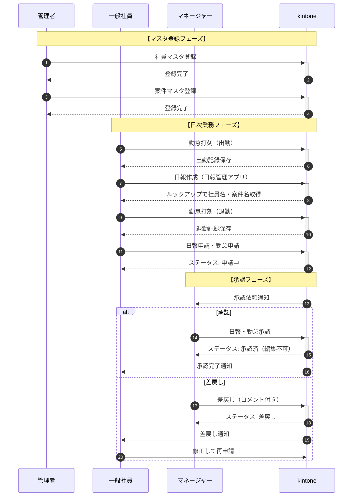
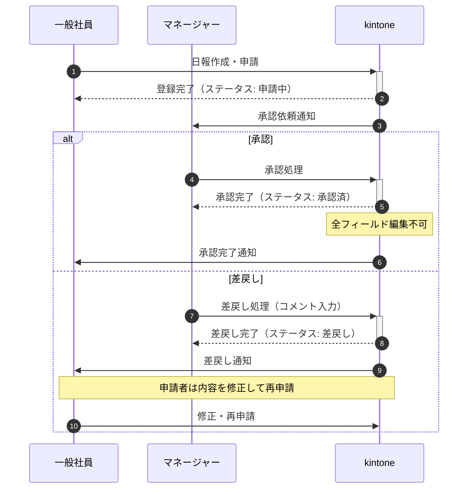
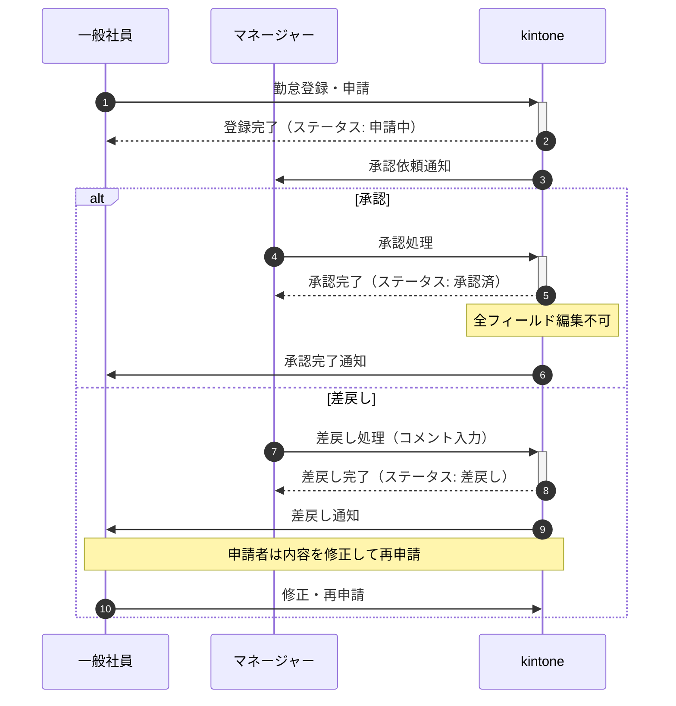
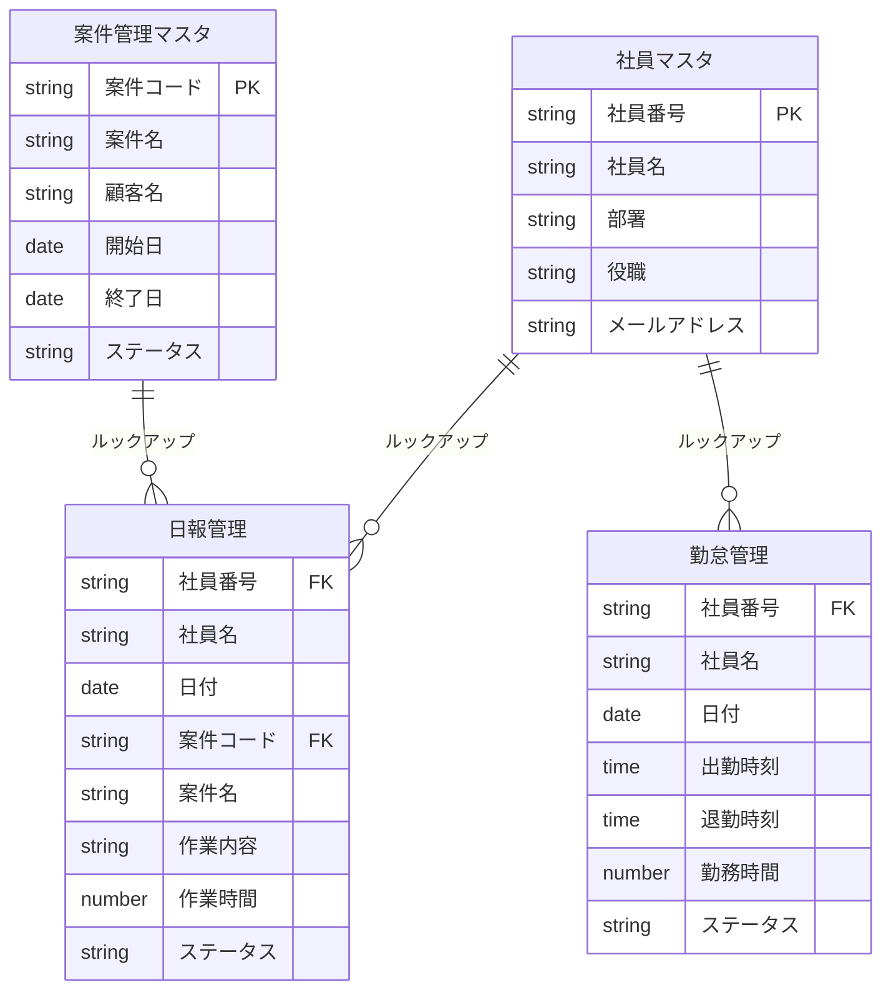

# 日報・勤怠管理 業務フロー

作成日: 2026/02/06
関連文書: システム概要書_日報・勤怠管理_20260206.md, 機能要件書_日報・勤怠管理_20260206.md

## 1. 業務フロー概要

### 1.1 全体像

本システムは4つのアプリで構成される。社員マスタと案件管理マスタは管理者が事前に登録しておき、一般社員はそれらのマスタデータをルックアップで参照しながら日報・勤怠を入力する。入力されたデータはマネージャーの承認を経て確定し、承認後は編集不可となる。

**アプリ間の関係**:
- 社員マスタ: 全アプリの基盤となる社員情報
- 案件管理マスタ: 日報で使用する案件情報
- 日報管理: 社員マスタ・案件管理マスタとルックアップ連携
- 勤怠管理: 社員マスタとルックアップ連携

### 1.2 業務フロー図（全体シーケンス図）

## 2. 業務詳細

### 2.1 社員マスタ登録

| 項目 | 内容 |
|------|------|
| 担当者 | 管理者（人事部・総務部） |
| トリガー | 新入社員の入社、社員情報の変更 |
| インプット | 社員番号、氏名、部署、役職、メールアドレス等 |
| アウトプット | 社員マスタレコード |
| 関連アプリ | 社員マスタ |

**処理手順**:
1. 管理者が社員マスタアプリを開く
2. 新規レコードを作成し、社員情報を入力
3. 保存して登録完了

### 2.2 案件マスタ登録

| 項目 | 内容 |
|------|------|
| 担当者 | 管理者 |
| トリガー | 新規案件の発生、案件情報の変更 |
| インプット | 案件コード、案件名、顧客名、開始日、終了日等 |
| アウトプット | 案件管理マスタレコード |
| 関連アプリ | 案件管理マスタ |

**処理手順**:
1. 管理者が案件管理マスタアプリを開く
2. 新規レコードを作成し、案件情報を入力
3. 保存して登録完了

### 2.3 日報作成・申請

| 項目 | 内容 |
|------|------|
| 担当者 | 一般社員 |
| トリガー | 日次（業務終了時） |
| インプット | 社員番号、日付、案件、作業内容、作業時間 |
| アウトプット | 日報レコード（申請中ステータス） |
| 関連アプリ | 日報管理 |

**処理手順**:
1. 社員が日報管理アプリを開く
2. 新規レコードを作成
3. 社員番号を入力し、ルックアップで社員名を取得
4. 案件コードを入力し、ルックアップで案件名を取得
5. 作業内容・作業時間を入力
6. 保存して申請

**ステータス遷移**:
作成中 → 申請中 → 承認済/差戻し

### 2.4 勤怠打刻・申請

| 項目 | 内容 |
|------|------|
| 担当者 | 一般社員 |
| トリガー | 出勤時・退勤時 |
| インプット | 社員番号、日付、出勤時刻、退勤時刻 |
| アウトプット | 勤怠レコード（申請中ステータス） |
| 関連アプリ | 勤怠管理 |

**処理手順**:
1. 社員が勤怠管理アプリを開く
2. 新規レコードを作成
3. 社員番号を入力し、ルックアップで社員名を取得
4. 出勤時刻・退勤時刻を入力
5. 保存して申請

**ステータス遷移**:
作成中 → 申請中 → 承認済/差戻し

### 2.5 日報・勤怠承認

| 項目 | 内容 |
|------|------|
| 担当者 | マネージャー |
| トリガー | 承認依頼通知の受信 |
| インプット | 申請中の日報・勤怠レコード |
| アウトプット | 承認済/差戻しレコード |
| 関連アプリ | 日報管理、勤怠管理 |

**処理手順**:
1. マネージャーが承認依頼通知を受け取る
2. 対象レコードを開いて内容を確認
3. 問題なければ承認、修正が必要な場合は差戻し
4. 承認後、レコードは編集不可となる

**ステータス遷移**:
申請中 → 承認済（完了）または 差戻し（修正後再申請）

## 3. ステータス定義

### 3.1 日報管理ステータス

| ステータス名 | 説明 | 次のステータス | 遷移条件 |
|--------------|------|----------------|----------|
| 作成中 | 下書き状態 | 申請中 | 社員が申請ボタンをクリック |
| 申請中 | 承認待ち状態 | 承認済/差戻し | マネージャーが承認/差戻し |
| 承認済 | 確定状態（編集不可） | - | 最終ステータス |
| 差戻し | 修正待ち状態 | 申請中 | 社員が修正して再申請 |

### 3.2 勤怠管理ステータス

| ステータス名 | 説明 | 次のステータス | 遷移条件 |
|--------------|------|----------------|----------|
| 作成中 | 下書き状態 | 申請中 | 社員が申請ボタンをクリック |
| 申請中 | 承認待ち状態 | 承認済/差戻し | マネージャーが承認/差戻し |
| 承認済 | 確定状態（編集不可） | - | 最終ステータス |
| 差戻し | 修正待ち状態 | 申請中 | 社員が修正して再申請 |

## 4. 承認フロー

### 4.1 日報承認フロー図

### 4.2 勤怠承認フロー図

### 4.3 承認ルート一覧

| 申請者 | 承認者 | 条件 |
|--------|--------|------|
| 一般社員 | 所属部署のマネージャー | 直属の上長 |

※プロセス管理の作業者設定で、所属部署のマネージャーを承認者として設定

## 5. アプリ間連携図

